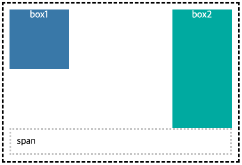

# float 해제

float이라는 속성은 주어진 요소뿐만 아니라 주변의 요소들의 배치에도 영향을 주어서 사용하기 까다로운 속성 중 하나입니다.
float 속성을 레이아웃이나 요소의 배치에 사용하게 될 때 함께 사용되어야 하는 작업이 float의 영향에서 해제시키는 방법입니다.
float을 해제할 수 있는 CSS의 여러가지 방법들을 알아봅니다.

### float이 끼치는 영향

float의 해제를 하기 위해서는 먼저 float의 특성을 알아야 합니다.
우리가 흔히 float의 상황에서 해제가 필요하다고 할만한 상황은 아래의 내용과 같은 float의 특성 때문에 발생하게 됩니다.

- float이 적용된 요소는 보통의 흐름에서 벗어나 layout상 띄워짐
- 주변 텍스트나 인라인 요소들이 주위를 감싸는 특징이 있음

### float을 해제하는 방법

### 부모 요소에 height 값 부여

부모 요소에 height 값을 부여하여 float을 해제하는 방법입니다.

부모 요소의 height 값이 없는 경우 그림과 같이 같이 좌우로 floating 된 요소를 가지고 있는 부모 요소를 점선으로 표시했습니다.

floating 된 자식 요소의 height 값만큼을 부모 요소에 height 값을 부여해 공간을 늘려 마치 floating 된 내용이 해제된 것처럼 보이는 효과를 줍니다.

```html
<!DOCTYPE html>
<html lang="ko">
	<head>
		<meta charset="UTF-8">
		<title>float 해제 방법 - 부모 요소에 height 부여</title>
		<style>
			.wrap {
				width: 400px;
				margin: 0 auto;
			}

			.parent {
				/* 자식 box들의 height 값이 고정일 경우 같은 height 값을 부여 */
				/* height: 100px; */
				padding: 10px;
				border: 3px dashed black;
			}

			.box {
				width: 100px;
				height: 100px;
				color: #fff;
				text-align: center;
			}

			.box1 {
				float: left;
				background-color: steelblue;
			}

			.box2 {
				float: right;
				height: 100px;
				/* height: 200px; */
				background-color: lightseagreen;
			}
		</style>
	</head>
	<body>
		<div class="wrap">
			<div class="parent">
				<div class="box box1">box1</div>
				<div class="box box2">box2</div>
			</div>
		</div>
	</body>
</html>
```

코드의 주석 내용과 같이 두 자식인 .box의 height 값이 100px로 고정일 경우에 부모인 .parent에 똑같은 height 값인 100px을 부여함으로써 float의 영향에서 벗어난 것처럼 만들 수 있습니다.

하지만 이는 전체의 흐름을 방해하지 않도록 하는 방법일 뿐 정확하게는 float이 해제된 것처럼 보이는 눈속임과 같은 해제 방법이라고 할 수 있습니다.

예를 들어 .box2의 height 값을 200px로 바꾼다면 부모의 height 값은 고정이기 때문에 이처럼 자식 요소가 넘치는 현상이 일어나게 됩니다.

결론적으로 이 방법은 자식 요소가 고정된 height 값을 가지며 부모 역시 고정된 height 값을 가진 경우에만 사용할 수 있습니다.

### 부모 요소에 float 속성 부여

자식 요소가 좌우로 floating 되었을때 부모가 float 속성(none 제외)을 가진다면 그 부모 요소는 자식 요소의 높이 값을 수렴하게 됩니다.

```html
<!DOCTYPE html>
<html lang="ko">
	<head>
		<meta charset="UTF-8">
		<title>float 해제 방법 - 부모 요소에 float 속성 부여</title>
		<style>
			.wrap {
				width: 400px;
				margin: 0 auto;
				padding: 10px;
				border: 3px dotted #ccc;
			}

			.parent {
				/* 부모 요소에 float 속성 부여 */
				float: left;
				padding: 10px;
				border: 3px dashed black;
			}

			.box {
				width: 100px;
				height: 100px;
				color: #fff;
				text-align: center;
			}

			.box1 {
				float: left;
				background-color: steelblue;
			}

			.box2 {
				float: right;
				height: 100px;
				background-color: lightseagreen;
			}
		</style>
	</head>
	<body>
		<div class="wrap">
			<div class="parent">
				<div class="box box1">box1</div>
				<div class="box box2">box2</div>
			</div>
		</div>
	</body>
</html>
```

.wrap으로부터 주어진 width: 400px;의 값에서 부모가 floating 되면서 스스로의 사이즈를 수렴되는 자식 요소의 가로 사이즈 만큼으로 줄어듭니다.

이미지와 같이 부모가 float 속성을 이미 가지고 있을 시에는 자식의 float 속성을 따로 해제해 주지 않아도 됩니다.
하지만 그 부모의 요소 또한 float의 영향을 받기 때문에 부모 요소인 .parent가 floating 되면서 .parent의 부모인 .wrap이 float의 해제가 필요한 상태가 됩니다.

결론적으로 이 방법은 이미 floating이 되어있는 부모 요소가 자식 요소들이 floating이 된다고 했을때 굳이 따로 해제 방법을 보유할 필요가 없다는 정도로 인식을 하고 마크업해야 합니다.
때문에 자식 요소의 floating을 해제하기 위해서 부모 요소에 float 속성을 부여하는 방식으로 해제하는 것은 별로 좋지 않은 방법입니다.

### 부모 요소에 overflow 속성을 이용 (visible 제외)

이 방법은 여러 가지 해제 방법 중에 가장 간단한 방법입니다.

```html
<!DOCTYPE html>
<html lang="ko">
	<head>
		<meta charset="UTF-8">
		<title>float 해제 방법 - 부모 요소에 overflow 속성 부여</title>
		<style>
			.wrap {
				width: 400px;
				margin: 0 auto;
			}

			.parent {
				/* 부모 요소에 overflow 속성 부여 (visible 제외) */
				overflow: hidden;
				position: relative;
				padding: 10px;
				border: 3px dashed black;
			}

			.box {
				width: 100px;
				height: 100px;
				color: #fff;
				text-align: center;
			}

			.box1 {
				float: left;
				background-color: steelblue;
			}

			.box2 {
				float: right;
				/* height: 100px; */
				height: 200px;
				background-color: lightseagreen;
			}

			.popup {
				position: absolute;
				right: -50px;
				top: 170px;
				width: 100px;
				height: 100px;
				color: #fff;
				background-color: crimson;
			}
		</style>
	</head>
	<body>
		<div class="wrap">
			<div class="parent">
				<div class="box box1">box1</div>
				<div class="box box2">box2</div>
				<div class="popup">popup</div>
			</div>
		</div>
	</body>
</html>
```

방법은 아주 간단합니다.
부모 요소에 overflow 속성을 부여하면 됩니다. (visible 제외)
(팝업이 position: absolute; 속성을 이용하여 띄워진다는 가정 하에 부모 요소에 position: relative; 속성이 추가되었습니다.)

위와 같은 방법으로 아주 간단한 한 줄을 추가하여 float의 상황에서 벗어날 수 있습니다.

예를 들어 부모 요소에 height 값 부여 방법에서의 문제점이었던 .box2의 height 값을 200px로 변경하더라도 자식의 height 값을 그대로 수렴합니다.

하지만 이 방법에도 치명적인 단점이 있습니다.
만약 이 부모 요소 안에 부모의 영역을 벗어나는 팝업과 같은 자식 컨텐츠가 있을 경우 팝업의 내용이 보이지 않는 현상이 일어납니다.

overflow 속성을 부여하는 방법의 유일하고 가장 큰 단점 중에 하나입니다.

결론적으로 이 방법을 사용하여 float을 해제할 때에는 이처럼 안의 내용 중에 부모의 내용을 넘쳐나서 노출되는 컨텐츠는 없는지 확인이 되고 파악이 됐을때 사용하여야 합니다.
하지만 이게 가장 간단하고 확실한 해제 방법이기 때문에 이후에 나올 가상 요소를 이용한 해제 방법과 더불어서 단점만 정확하게 피할 수 있다면 가장 많이 사용하는 해제 방법 중에 하나입니다.

### 인접 형제 요소에 clear 속성을 이용

인접 형제 요소의 clear 속성을 부여하는 방법입니다.
clear 속성은 float의 흐름을 끊기 위한 float 해제 전용 속성입니다.

```html
<!DOCTYPE html>
<html lang="ko">
	<head>
		<meta charset="UTF-8">
		<title>float 해제 방법 - 인접 형제 요소에 clear 속성 부여</title>
		<style>
			.wrap {
				width: 400px;
				margin: 0 auto;
			}

			.parent {
				padding: 10px;
				border: 3px dashed black;
			}

			.box {
				width: 100px;
				height: 100px;
				color: #fff;
				text-align: center;
			}

			.box1 {
				float: left;
				background-color: steelblue;
			}

			.box2 {
				float: right;
				height: 100px;
				/* height: 200px; */
				background-color: lightseagreen;
			}

			.clear {
				clear: both;
				display: block;
				padding: 10px;
				border: 3px dotted #ccc;
			}
		</style>
	</head>
	<body>
		<div class="wrap">
			<div class="parent">
				<div class="box box1">box1</div>
				<div class="box box2">box2</div>
				<!-- <div class="clear"></div> -->
				<span class="clear">span</span>
			</div>
		</div>
	</body>
</html>
```

설명에 앞서 clear 속성의 값을 잠깐 설명하자면 clear는 none, left, right, both의 속성 값을 가질수 있으며, 이는 각각 float의 left, right, 방향에 상관없이 좌우 모두 해제를 할 수 있습니다. (none은 default 값으로 해제를 하지 않습니다.)

그림과 같이 마크업의 순서로 보자면 자식 요소가 box1, box2, 빈 `<span>` 태그의 순서로 되어 있습니다.
box1, 2는 좌, 우로 floating 되어있는 상태이고, 그와 인접해 있는 형제 요소인 빈 `<span>` 태그에 clear: both; 속성이 부여되었습니다.

이 방법 또한 .box2의 height 값을 200px로 변경하더라도 자식의 height 값을 그대로 수렴합니다.

clear 속성을 사용하기 위해서는 해당 요소가 block-level 요소여야만 부모 요소의 사이즈를 상속받아서 해제가 가능하기 때문에 display: block; 속성을 추가하여 inline-level인 `<span>` 태그를 block-level로 변경해 주었습니다.

이와 같은 방법은 clear라는 float을 해제시키는 전용 속성을 이용하여 가장 깔끔하게 float의 해제를 할 수 있습니다.

하지만 이를 위해서는 아무런 의미가 없는 빈 태그를 사용해야 하기 때문에 각 태그 별로 의미를 갖는 시멘틱적인 마크업에서는 불필요한 요소가 생기는 것이기에 조금 번잡하다는 단점이 존재합니다.

### 가상 요소에 clear 속성을 이용

위에서 설명한 빈 태그의 clear 속성을 이용한 해제가 시멘틱적인 마크업에서의 불필요한 태그가 추가된다는 단점을 보완할 수 있는 해제 방법입니다.

```html
<!DOCTYPE html>
<html lang="ko">
	<head>
		<meta charset="UTF-8">
		<title>float 해제 방법 - 가상 요소에 clear 속성 부여</title>
		<style>
			.wrap {
				width: 400px;
				margin: 0 auto;
			}

			.parent {
				padding: 10px;
				border: 3px dashed black;
			}

			.box {
				width: 100px;
				height: 100px;
				color: #fff;
				text-align: center;
			}

			.box1 {
				float: left;
				background-color: steelblue;
			}

			.box2 {
				float: right;
				height: 100px;
				/* height: 200px; */
				background-color: lightseagreen;
			}

			.parent:after {
				clear: both;
				display: block;
				content: ':after';
				padding: 10px;
				border: 3px dotted #ccc;
			}
		</style>
	</head>
	<body>
		<div class="wrap">
			<div class="parent">
				<div class="box box1">box1</div>
				<div class="box box2">box2</div>
			</div>
		</div>
	</body>
</html>
```

인접 형제 요소에 clear 속성 부여 방법과 동일한 조건으로 구성된 코드입니다.
빈 태그는 여기에서는 부여되지 않고 부모 요소에 빈 태그 대신 가상 요소를 활용해서 float을 해제합니다.

부모의 :after 가상 요소를 블록 요소로 변경하기 위해 display: block; 속성이 필요하고, float의 해제를 위해 clear 속성을 추가하였습니다.

마지막으로 가상 요소는 content 속성이 필수이기 때문에, content 속성의 값을 빈 값으로 지정해 주어 빈 태그를 넣어준 것과 같은 효과를 만들어 주었습니다.

이렇게 하면 빈 태그로 clear 속성을 준 효과와 동일한 효과를 주면서 시멘틱 마크업에 반하지 않는 그런 해제 방법이 완성됩니다.

이 해제 방법은 부모 요소에 overflow 속성을 사용하는 방법의 단점인 부모 요소의 영역을 벗어나는 팝업과 같은 자식 컨텐츠가 존재하는 경우에도 대응이 됩니다.
때문에 해제 방법으로 가장 보편적으로 많이 사용하고 있는 방법입니다.

---

### 요약 정리

각 해제 방법은 상황별로 특징을 잘 알고 사용해야 하며, 그 중 overflow 속성이나 가상 요소를 이용한 방법이 가장 보편적으로 많이 사용하는 방법이지만, 정답이 있는 것은 아니고 여러 가지 방법 중에 상황 별로 해제 방법을 선택해야 합니다.

추가적으로 float, overflow 속성이 왜 그러한 오류와 같은 현상을 발생하게 만드는지에 대해서 BFC(Block Formatting Context)의 개념을 알고 있어야 합니다.

---

### 참고자료

[Block formatting context](https://developer.mozilla.org/en-US/docs/Web/Guide/CSS/Block_formatting_context)

[Understanding CSS Layout And The Block Formatting Context - Smashing Magazine](https://www.smashingmagazine.com/2017/12/understanding-css-layout-block-formatting-context/)
